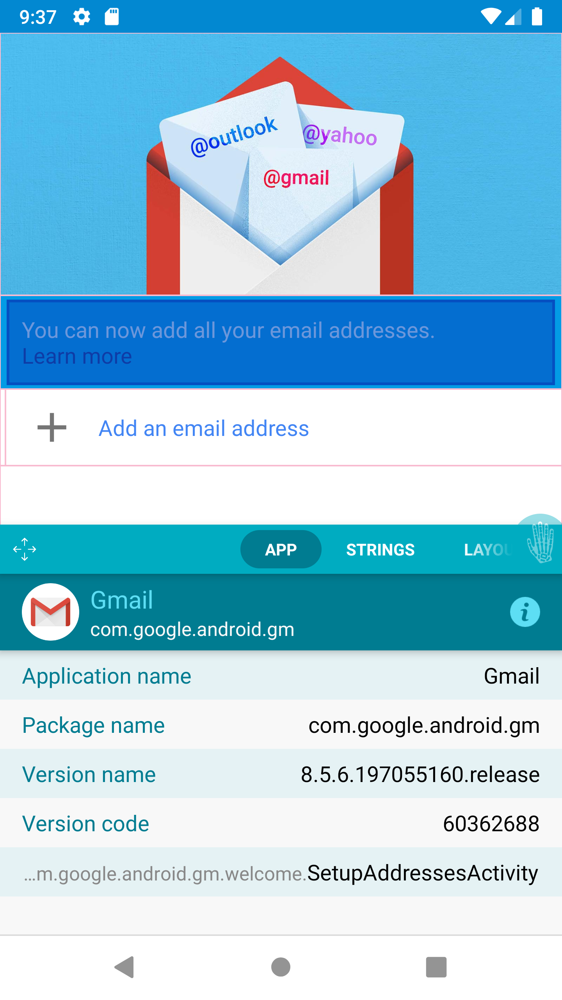
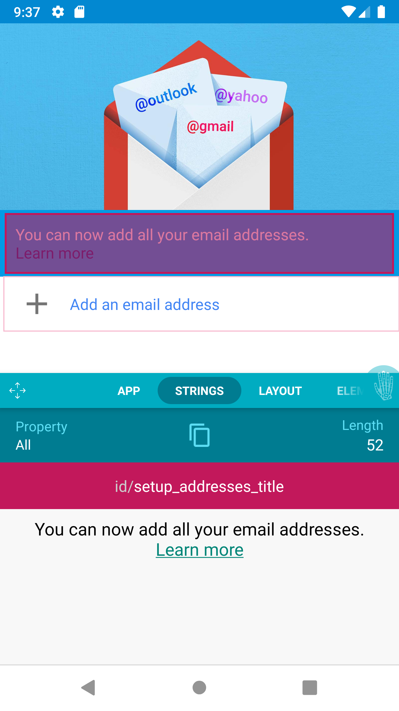
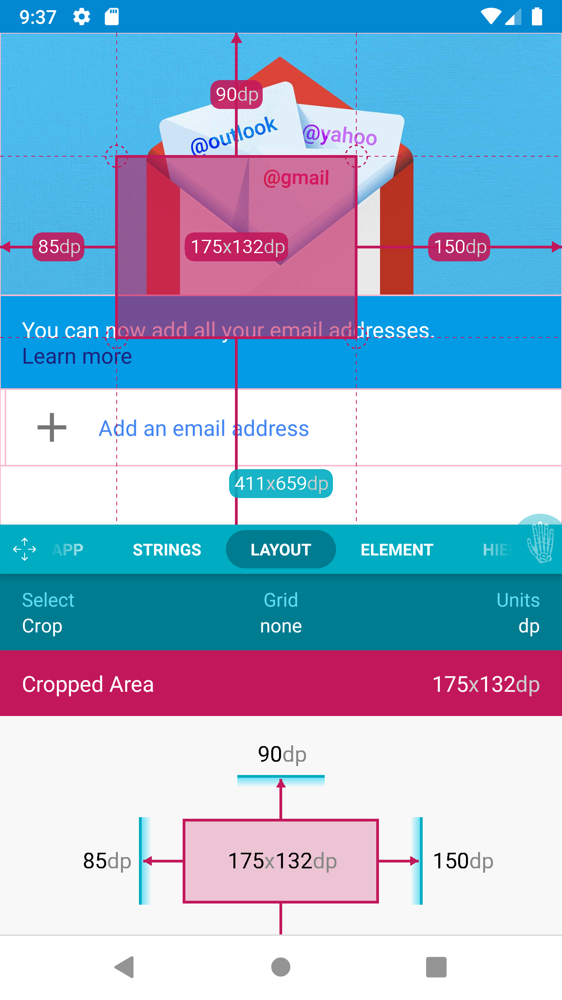
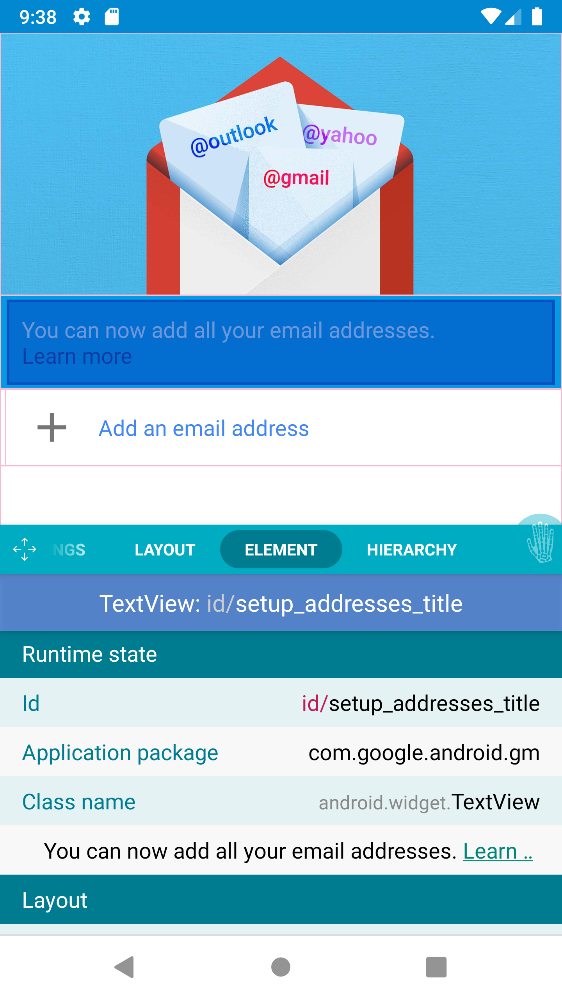
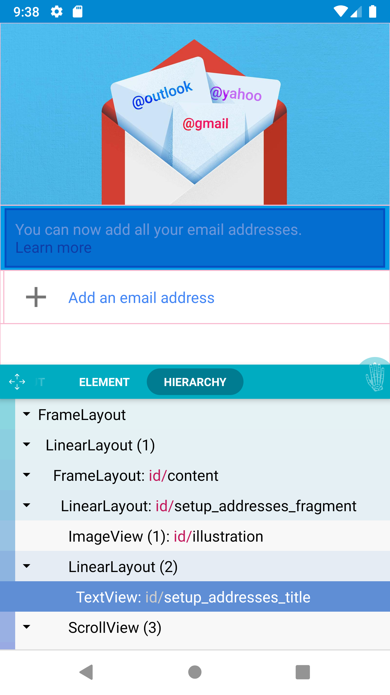

# InspectElement

|  |  |  |  |  |
| ------------- | ------------- | ------------- | ------------- | ------------- |

This project was just an exercise based on [Android Developer Assistant](https://github.com/jwisniewski/android-developer-assistant), I have used [AccessibilityService](https://developer.android.com/reference/android/accessibilityservice/AccessibilityService) for inspecting, You can change it to be a device assistance app and it's actully the same as AccessibilityService

[See Preview](./images/inspect.gif)

[Developer Assistant's official wiki](https://github.com/jwisniewski/android-developer-assistant/wiki) says: 
 > The Developer Assistant brings inspection tools well known from web browsers directly to Android devices. It can display view hierarchy, help with layout, translations and more. The inspection works for all native apps (and works well for most of them;). There is no need to integrate any special SDK, nor any library to the inspected app.

  

  
   <a>Amir Hossein Aghajari</a> • <a href="mailto:amirhossein.aghajari.82@gmail.com">Email</a> • <a href="https://github.com/Aghajari">GitHub</a>

